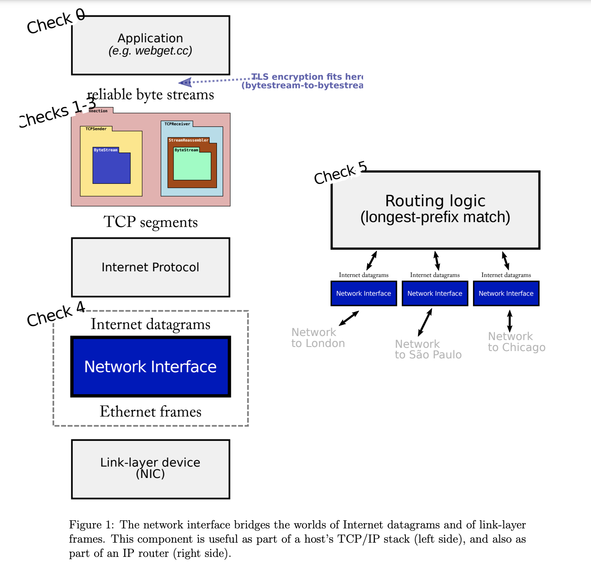
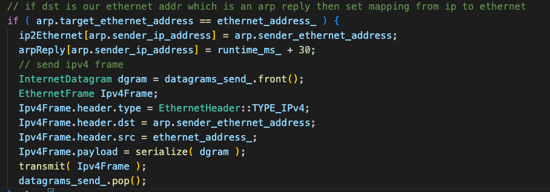
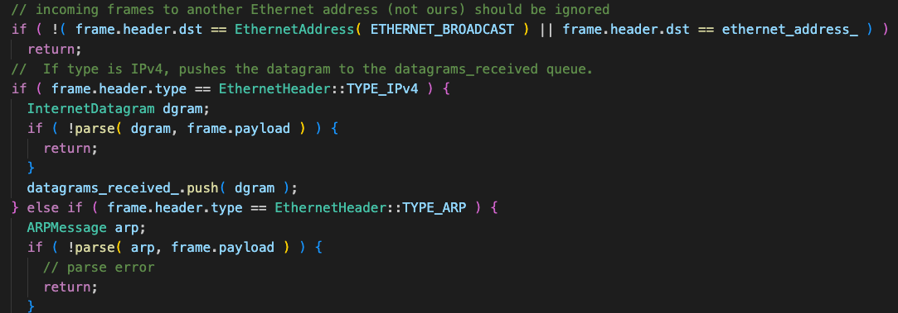

# Lab Checkpoint 5: down the stack (the network interface)
我们随着lab5继续走向网络接口层。

这个图是0-5的一个图解，可以以这张图做一个复习<br>
当看完check0的讲义后，可以开始进行代码。
我们创建一个arpMsg,之后放进ethernet frame的payload，设置好对应的ethernet header后，使用transmit方法进行广播。

注意arp的dst地址为默认地址，当reply的时候可以获得地址填充。
以及ipv4时候，对于datagram_receive_的填充。
对于目标地址非法的忽略。

在收到arp请求的时候，将广播询问的地址为自己的ip_addr和自己mapping已知的告知即可。
注意将arp request的ethernet_addr记录到mapping。
最后还有5秒与30秒到过期，比较简单，完整代码看下面。
记住每个步骤都commit，方便思考和回顾。
```c++
#include "network_interface.hh"
#include "arp_message.hh"
#include "exception.hh"

#include <iostream>
#include <ostream>

using namespace std;

const uint32_t THIRTY_SECONDS = 30 * 1000;
const uint32_t FIVE_SECONDS = 5 * 1000;

//! \param[in] ethernet_address Ethernet (what ARP calls "hardware") address of the interface
//! \param[in] ip_address IP (what ARP calls "protocol") address of the interface
NetworkInterface::NetworkInterface( string_view name,
                                    shared_ptr<OutputPort> port,
                                    const EthernetAddress& ethernet_address,
                                    const Address& ip_address )
  : name_( name )
  , port_( notnull( "OutputPort", move( port ) ) )
  , ethernet_address_( ethernet_address )
  , ip_address_( ip_address )
{
  cerr << "DEBUG: Network interface has Ethernet address " << to_string( ethernet_address ) << " and IP address "
       << ip_address.ip() << "\n";
}

//! \param[in] dgram the IPv4 datagram to be sent
//! \param[in] next_hop the IP address of the interface to send it to (typically a router or default gateway, but
//! may also be another host if directly connected to the same network as the destination) Note: the Address type
//! can be converted to a uint32_t (raw 32-bit IP address) by using the Address::ipv4_numeric() method.
void NetworkInterface::send_datagram( const InternetDatagram& dgram, const Address& next_hop )
{
  EthernetFrame frame;
  uint32_t next_ip_addres = next_hop.ipv4_numeric();
  // don't exist, broadcast and queue the ipdatagram
  if ( ip2Ethernet.find( next_ip_addres ) == ip2Ethernet.end() ) {
    // 5 seconds don't resend
    if ( arpReq.find( next_ip_addres ) != arpReq.end() ) {
      return;
    }
    // broadcast arp request
    ARPMessage arp;
    arp.opcode = ARPMessage::OPCODE_REQUEST;
    arp.sender_ethernet_address = ethernet_address_;
    arp.sender_ip_address = ip_address_.ipv4_numeric();
    arp.target_ip_address = next_ip_addres;
    arp.target_ethernet_address = EthernetAddress();
    // Sending is accomplished by calling `transmit()` (a member variable) on the frame
    frame.header.type = EthernetHeader::TYPE_ARP;
    frame.header.src = ethernet_address_;
    frame.header.dst = EthernetAddress( ETHERNET_BROADCAST );
    frame.payload = serialize( arp );
    transmit( frame );
    // queue the IP datagram so it can be sent after
    // the ARP reply is received
    datagrams_send_.push( dgram );
    // 5 seconds expire to resend
    arpReq[next_ip_addres] = runtime_ms_ + FIVE_SECONDS;
    return;
  }
  // create ethernet frame and set serilize payload
  EthernetAddress next = ip2Ethernet[next_ip_addres];
  frame.header.type = EthernetHeader::TYPE_IPv4;
  frame.header.src = ethernet_address_;
  frame.header.dst = next;
  frame.payload = serialize( dgram );
  transmit( frame );
  return;
}

//! \param[in] frame the incoming Ethernet frame
void NetworkInterface::recv_frame( const EthernetFrame& frame )
{
  // incoming frames to another Ethernet address (not ours) should be ignored
  if ( !( frame.header.dst == EthernetAddress( ETHERNET_BROADCAST ) || frame.header.dst == ethernet_address_ ) )
    return;
  //  If type is IPv4, pushes the datagram to the datagrams_received queue.
  if ( frame.header.type == EthernetHeader::TYPE_IPv4 ) {
    InternetDatagram dgram;
    if ( !parse( dgram, frame.payload ) ) {
      return;
    }
    datagrams_received_.push( dgram );
  } else if ( frame.header.type == EthernetHeader::TYPE_ARP ) {
    ARPMessage arp;
    if ( !parse( arp, frame.payload ) ) {
      // parse error
      return;
    }
    // if dst is our ethernet addr which is an arp reply then set mapping from ip to ethernet
    if ( arp.target_ethernet_address == ethernet_address_ ) {
      ip2Ethernet[arp.sender_ip_address] = arp.sender_ethernet_address;
      arpReply[arp.sender_ip_address] = runtime_ms_ + THIRTY_SECONDS;
      // send ipv4 frame
      InternetDatagram dgram = datagrams_send_.front();
      EthernetFrame Ipv4Frame;
      Ipv4Frame.header.type = EthernetHeader::TYPE_IPv4;
      Ipv4Frame.header.dst = arp.sender_ethernet_address;
      Ipv4Frame.header.src = ethernet_address_;
      Ipv4Frame.payload = serialize( dgram );
      transmit( Ipv4Frame );
      datagrams_send_.pop();
    } else if ( arp.target_ip_address == ip_address_.ipv4_numeric()
                || ip2Ethernet.find( arp.target_ip_address ) != ip2Ethernet.end() ) {
      // target ip addr is mine, or mapping know the target ip addr
      // get an arp request, send arp reply
      EthernetAddress replyAddr;
      if ( arp.target_ip_address == ip_address_.ipv4_numeric() ) {
        replyAddr = ethernet_address_;
      } else {
        replyAddr = ip2Ethernet[arp.target_ip_address];
      }
      // When you recv a request, you should remember the sender ip2ethernet mapping
      ip2Ethernet[arp.sender_ip_address] = arp.sender_ethernet_address;
      arpReply[arp.sender_ip_address] = runtime_ms_ + THIRTY_SECONDS;
      ARPMessage replyArp;
      replyArp.target_ethernet_address = arp.sender_ethernet_address;
      replyArp.target_ip_address = arp.sender_ip_address;
      replyArp.sender_ethernet_address = replyAddr;
      replyArp.sender_ip_address = arp.target_ip_address;
      replyArp.opcode = ARPMessage::OPCODE_REPLY;
      EthernetFrame replyFrame;
      replyFrame.header.type = EthernetHeader::TYPE_ARP;
      replyFrame.header.src = replyAddr;
      replyFrame.header.dst = arp.sender_ethernet_address;
      replyFrame.payload = serialize( replyArp );
      transmit( replyFrame );
    }
  }
}

//! \param[in] ms_since_last_tick the number of milliseconds since the last call to this method
void NetworkInterface::tick( const size_t ms_since_last_tick )
{
  runtime_ms_ += ms_since_last_tick;
  for ( map<uint32_t, uint32_t>::iterator it = arpReply.begin(); it != arpReply.end(); ) {
    if ( it->second > runtime_ms_ ) {
      it++;
      continue;
    }
    ip2Ethernet.erase( it->first );
    it = arpReply.erase( it );
  }
  // 5 seconds pass
  for ( map<uint32_t, uint32_t>::iterator it = arpReq.begin(); it != arpReq.end(); ) {
    if ( it->second > runtime_ms_ ) {
      it++;
      continue;
    }
    it = arpReq.erase( it );
  }
}

```

