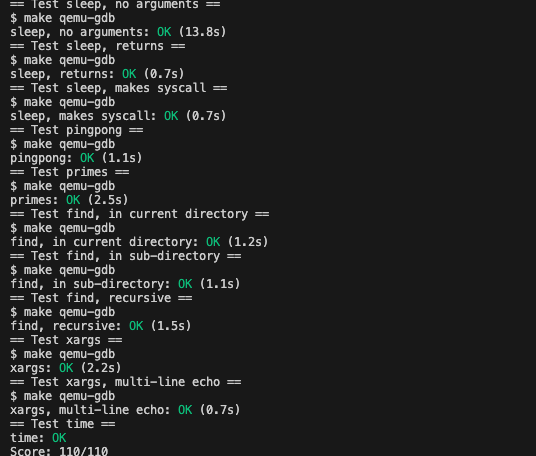

# Lab1
阅读handout中的chapter1.
[Lab: Xv6 and Unix utilities](https://pdos.csail.mit.edu/6.1810/2024/labs/util.html)

## 安装环境
[lab tools](https://pdos.csail.mit.edu/6.1810/2024/tools.html)

镜像安装ubuntu24.04
```
ubuntu:
    image: ubuntu:24.04
    volumes:
      - $DOCUMENT_PATH:/home/Documents
    networks:
      backend-activity:
        ipv4_address: $BACK_UBUNTU_IP
    container_name: ubuntu
    stdin_open: true
    tty: true
```

## Lab util: Unix utilities

### sleep(easy)
```c
#include "kernel/types.h"
#include "kernel/stat.h"
#include "user/user.h"


int
main(int argc, char *argv[])
{
  if ( argc < 2) {
    fprintf(2, "Pls send a number\n");
    exit(1);
  }
  sleep(atoi(argv[2]));
  fprintf(1, "(nothing happens for a little while)\n");
  exit(0);
}
```

```bash
./grade-lab-util sleep
```

开始的练手小作业，注意去MAKEFILE增加编译即可

### pingpong
```c
#include "kernel/types.h"
#include "kernel/stat.h"
#include "user/user.h"


int
main(int argc, char *argv[])
{
  int p[2]; 
  pipe(p);
  char buf[4];

  // child process
  if (fork() == 0) {
    read(p[0], buf, 4);   
    close(p[0]);
    write(p[1], "pong", 4);
    close(p[1]); 
    fprintf(1, "%d: receive %s \n", getpid(), buf); 
    exit(0);   
  } 

  write(p[1], "ping", 4);
  close(p[1]);
  // Parent process run here and wait child
  wait(0); //waitpid
  read(p[0], buf, 4);
  close(p[0]);
  fprintf(1, "%d: receive %s \n", getpid(), buf);
  exit(0);
}
```

### primes

[CSP Models](https://swtch.com/~rsc/thread/) csp模型讲述了并发进程的通信，推荐阅读。


卡了我好久，这一段，这是2024最新的课程，2到280区间的素数。
筛选逻辑就不说了，看论文就有，重点是这里的关闭管道文件，如果没有关闭管道，那么在到素数37的时候，你的资源就会耗尽。
pipe(p) 会返回-1.
还好阅读了book-riscv-rev4的内容，里面wc有一段代码
```c
if(fork() == 0) {
  close(0);
  dup(p[0]);
  close(p[0]);
  close(p[1]);
  exec("/bin/wc", argv);
}
```
这里告诉你如何提前利用标准输入去做fd，提前关闭管道。
完成这里之后如果显示有换行，记得在函数wait(0)。保证时序。

### find
打开ls.c，复制然后阅读代码。
没什么难点，注意C语言字符串实际就是一个*char指针即可
```c
#include "kernel/types.h"
#include "kernel/stat.h"
#include "user/user.h"
#include "kernel/fs.h"
#include "kernel/fcntl.h"


void
find(char *path, char *filename)
{
  char buf[512], *p;
  int fd;
  struct dirent de;
  struct stat st;
  char cur[] = ".";
  char prev[] = "..";

  if((fd = open(path, O_RDONLY)) < 0){
    fprintf(2, "find: cannot open %s\n", path);
    return;
  }

  if(fstat(fd, &st) < 0){
    fprintf(2, "find: cannot stat %s\n", path);
    close(fd);
    return;
  }

  if (st.type != T_DIR) {
    fprintf(2, "find: path %s not a dir\n", path);
    close(fd);
    return;
  }

  if(strlen(path) + 1 + DIRSIZ + 1 > sizeof buf){
    printf("find: path too long\n");
    close(fd);
    return;
  }
  strcpy(buf, path);
  p = buf+strlen(buf);
  *p++ = '/';
  while(read(fd, &de, sizeof(de)) == sizeof(de)){
    if(de.inum == 0)
      continue;
    memmove(p, de.name, DIRSIZ);
    p[DIRSIZ] = 0;
    // c string is a pointer link to first char
    if(stat(buf, &st) < 0 || strcmp(cur, p) == 0 || strcmp(prev, p) == 0 ){
      // printf("skip %s %d  %d \n", p, *(prev+2), *(p+2));
      continue;
    }
    if (st.type == T_DIR) {
      // recursive
      find(buf, filename);
      continue;
    }
    // find and print
    if ( strcmp(p, filename) == 0) {
       printf("%s\n", buf);
    }
  }
  close(fd);
}


int
main(int argc, char *argv[])
{
  if(argc != 3){
    fprintf(2, "error params");
    exit(0);
  }
  find(argv[1], argv[2]);
  exit(0);
}

```

### xargs
这个考点主要考exec的使用以及对c字符串的理解
char*分配一个指针地址大小的内存。
不过最后过是靠fprintf了参数过的，不知道哪里有问题。
这题也男调试，晚点再回来复查。
```c
#include "kernel/param.h"
#include "kernel/types.h"
#include "kernel/stat.h"
#include "user/user.h"

char*
readArgs()
{
  char* args = malloc(MAXARG * sizeof(char));
  char* tmp = args;
  while(read(0, tmp, sizeof(char)) != 0) {
    if(*tmp == '\n' || *tmp == '\0') {
      *tmp = '\0';
      return args;
    }
    tmp++;
  }
  if ( tmp != args) {
    return args;
  }
  return 0;
}

int
main(int argc, char *argv[])
{
  if(argc > MAXARG || argc < 2){
    fprintf(2, "error params");
    exit(0);
  }
  char* cmd = argv[1];
  char** newArgv;
  char* args;
  newArgv = malloc(argc * sizeof(char*)); // 分配指针大小的数组空间
  // 跳过xargs
  for(int i = 1; i < argc; i++) {
    newArgv[i-1] = argv[i];
  }
  while( (args=readArgs()) != 0 ) {
    if(fork() == 0) {
      newArgv[argc-1] = args;
      fprintf(1, "%s\n", args);
      exec(cmd, newArgv);
    } 
    wait(0);
  }
  // fprintf(1, "cmd:%s argc:%d", cmd, argc);
  exit(0);
}

```


最后还发现了pingpong有个小bug，留给参考的同学改了