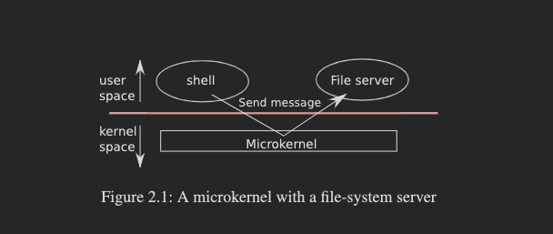
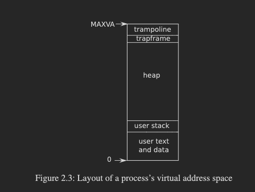

# Lab2

## Abstracting physical resources

## User mode,supervisor mode, and system calls

## Operating system organization

### Kernel organiztion

* monolithic kernel 性能高，内核一个模块出问题会影响整个系统，拓展性差，交互简单，因为共用一个内存空间。
* microkernel 灵活可靠，性能相对差，因为需要频繁的切换上下文

## Code:xv6 organization

## Process overview

* trampoline 跳板，4096byte，以实现函数调用和控制流的转移。
* trapframe 陷阱帧
    * 指令计数器(Programe Counter PC)
    * 栈指针(Stack Pointer SP)
    * 寄存器状态
    * 中断或者其他异常类型
通过trampoline和trapframe实现转换进入内核和返回。
trampoline实现内核的进入和返回，trapframe保存了进城的状态和信息。
